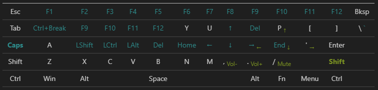

# My AHK Scripts

This repository contains:
  - a collection of my personal [AutoHotkey (AHK v1.1)](https://www.autohotkey.com/) scripts.
  - HaKey, a C++ application that is implementing _most of_ my AHK Script's functionality.

## Layout
A representation of changes in a 60% keyboard. Note that alternative layers are not displayed.

## Scripts (AHK, windows)

Here is a list of the scripts and a brief description of each:

- [`main.ahk`](scripts/main.ahk): The main script that includes all other scripts. I'm using `Task Scheduler` to run this script at user log on.

- [`homeRowNavigation.ahk`](scripts/homeRowNavigation.ahk): Implements custom home row modifiers using `CapsLock` as the main trigger. For example: `CapsLock` key combined with `i`, `j`, `k`, and `l` are remapped to arrows `↑`, `←`, `↓`, and `→` respectively.

- [`stringReplace.ahk`](scripts/stringReplace.ahk): Contains hotstrings for quickly inserting the current date and time in different formats.

- [`60pKeyRemap.ahk`](scripts/60pKeyRemap.ahk): Remaps various keys, designed for 60% keyboards. It remaps common keys used for debugging, text editing, and navigation.

- [`Find mike.ahk`](scripts/Find%20mike.ahk): Displays a list of device input settings.

- [`muteMike.ahk`](scripts/muteMike.ahk): Used to mute the microphone. More information in the script file.

- [`navigationLayer.ahk`](scripts/navigationLayer.ahk): No longer in use, but was used to make custom layers for navigation.

Please note that these scripts are designed for personal use and may need to be adjusted based on your specific needs and keyboard layout.

## HaKey (app)
The [HaKey](HaKey/) application was created as an alternative to AHK. Currently supporting Linux and Windows [^1].

### Stack:
- Written in C++ for performance and compatibility reasons 🏃‍♂️
- Created with modules for fast development and sanity 😇
- Used CMake and Clang, to be able to build from any platform. 👽
- Haven't followed C++ naming convention, it's more like C#. 🦄
- Non user-configurable; layers are hard-coded for my needs:
  - [`homeRowNavigation.ahk`](scripts/homeRowNavigation.ahk) in [HomeRowNavigation.cppm](HaKey/key/layers/HomeRowNavigation.cppm)
  - [`60pKeyRemap.ahk`](scripts/60pKeyRemap.ahk) in [60KeyRemap.cppm](HaKey/key/layers/60KeyRemap.cppm)

### Commands:
- CMake: `sudo apt install cmake`
- CLang tools: `sudo apt install clang-tools`
- __Build__:
  - Windows (VS): `cmake --preset=x64-release` & `cmake --build --preset=x64-release`
  - Windows (Clang): `cmake --preset=x64-release-clang` & `cmake --build --preset=x64-release-clang`
  - Linux (Clang): `cmake --preset=linux-release` & `cmake --build --preset=linux-release`
- __FAIL TO READ IO__ (input / uinput) on __LINUX__:
  - You need permissions to read the input: `sudo chmod +r /dev/input/event0`, change 0 with your input index from: `cat /proc/bus/input/devices`
  - and write in uinput: `sudo chmod a+rw /dev/uinput`

[^1]: Support for MacOS can be added (probably), but it's not planned.
